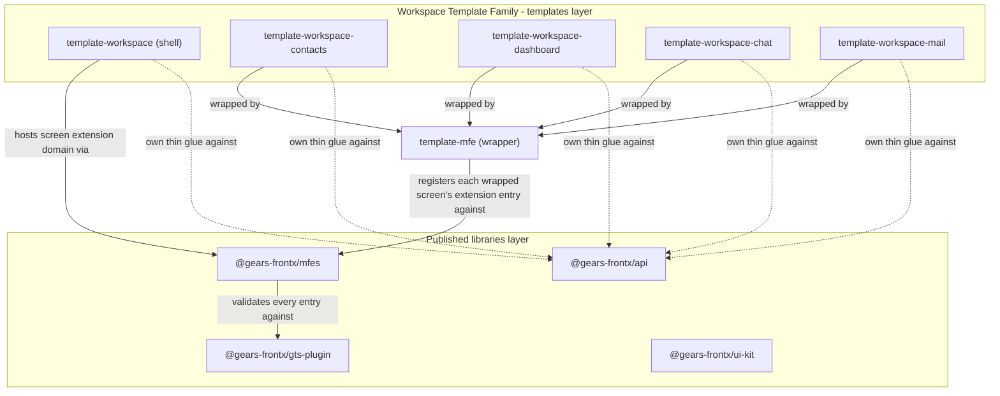
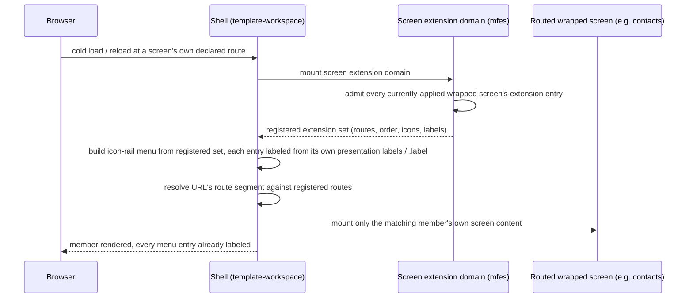

# Technical Design - Workspace Template Family

- [ ] `p3` - **ID**: `cpt-frontx-workspace-templates-design-workspace-templates`

<!-- toc -->

- [1. Architecture Overview](#1-architecture-overview)
  - [1.1 Architectural Vision](#11-architectural-vision)
  - [1.2 Architecture Drivers](#12-architecture-drivers)
  - [1.3 Architecture Layers](#13-architecture-layers)
- [2. Principles & Constraints](#2-principles--constraints)
  - [2.1 Design Principles](#21-design-principles)
  - [2.2 Constraints](#22-constraints)
  - [2.3 Obligations On The Consuming Level](#23-obligations-on-the-consuming-level)
- [3. Technical Architecture](#3-technical-architecture)
  - [3.1 Domain Model](#31-domain-model)
  - [3.2 Component Model](#32-component-model)
  - [3.3 API Contracts](#33-api-contracts)
  - [3.4 Internal Dependencies](#34-internal-dependencies)
  - [3.5 External Dependencies](#35-external-dependencies)
  - [3.6 Interactions & Sequences](#36-interactions--sequences)
  - [3.7 Database schemas & tables](#37-database-schemas--tables)
- [4. Additional context](#4-additional-context)
  - [Worked Example: The Family's GTS Surface](#worked-example-the-familys-gts-surface)
- [5. Traceability](#5-traceability)

<!-- /toc -->

**References to the FrontX ecosystem.** This document names the ecosystem decisions and artifacts it depends on by their `cpt-` id. None of them lives in this repository; they live in the FrontX ecosystem repository, [`gears-frontx`](https://github.com/constructorfabric/gears-frontx), at these paths on its `develop` branch:

| Named here as | File in the ecosystem repository |
|---|---|
| `cpt-frontx-adr-action-dispatch-and-chaining` | [architecture/ADR/0007-action-dispatch-and-chaining.md](https://github.com/constructorfabric/gears-frontx/blob/develop/architecture/ADR/0007-action-dispatch-and-chaining.md) |
| `cpt-frontx-adr-extension-domain-occupancy` | [architecture/ADR/0009-extension-domain-occupancy.md](https://github.com/constructorfabric/gears-frontx/blob/develop/architecture/ADR/0009-extension-domain-occupancy.md) |
| `cpt-frontx-adr-domain-extension-compatibility` | [architecture/ADR/0010-domain-extension-compatibility.md](https://github.com/constructorfabric/gears-frontx/blob/develop/architecture/ADR/0010-domain-extension-compatibility.md) |
| `cpt-frontx-adr-source-spec-syntax` | [architecture/ADR/0017-source-spec-syntax.md](https://github.com/constructorfabric/gears-frontx/blob/develop/architecture/ADR/0017-source-spec-syntax.md) |
| `cpt-frontx-adr-template-manifest-contract` | [architecture/ADR/0018-template-manifest-contract.md](https://github.com/constructorfabric/gears-frontx/blob/develop/architecture/ADR/0018-template-manifest-contract.md) |
| `cpt-frontx-adr-contract-schema-ownership` | [architecture/ADR/0027-contract-schema-ownership.md](https://github.com/constructorfabric/gears-frontx/blob/develop/architecture/ADR/0027-contract-schema-ownership.md) |
| `cpt-frontx-adr-uniform-template-mechanism` | [architecture/ADR/0030-uniform-template-mechanism.md](https://github.com/constructorfabric/gears-frontx/blob/develop/architecture/ADR/0030-uniform-template-mechanism.md) |
| `cpt-frontx-adr-template-territory-traceability` | [architecture/ADR/0033-template-territory-traceability.md](https://github.com/constructorfabric/gears-frontx/blob/develop/architecture/ADR/0033-template-territory-traceability.md) |
| the ecosystem's root PRD and DESIGN | [architecture/PRD.md](https://github.com/constructorfabric/gears-frontx/blob/develop/architecture/PRD.md), [architecture/DESIGN.md](https://github.com/constructorfabric/gears-frontx/blob/develop/architecture/DESIGN.md) |
| the CLI's own PRD and DESIGN | [packages/cli/architecture/PRD.md](https://github.com/constructorfabric/gears-frontx/blob/develop/packages/cli/architecture/PRD.md), [packages/cli/architecture/DESIGN.md](https://github.com/constructorfabric/gears-frontx/blob/develop/packages/cli/architecture/DESIGN.md) |
| the runtime's own PRD and DESIGN | [packages/mfes/architecture/PRD.md](https://github.com/constructorfabric/gears-frontx/blob/develop/packages/mfes/architecture/PRD.md), [packages/mfes/architecture/DESIGN.md](https://github.com/constructorfabric/gears-frontx/blob/develop/packages/mfes/architecture/DESIGN.md) |

The amendments to `cpt-frontx-adr-source-spec-syntax` and `cpt-frontx-adr-template-manifest-contract` that this document cites as amended land with [gears-frontx#609](https://github.com/constructorfabric/gears-frontx/pull/609), which merges before this change; the `develop` links above do not carry them yet.

## 1. Architecture Overview

### 1.1 Architectural Vision

The Workspace Template Family composes five independently-versioned template-territory directories - one shell, `template-workspace`, and four screens, `template-workspace-contacts`, `template-workspace-dashboard`, `template-workspace-chat`, `template-workspace-mail` - into one application, reusing the runtime's existing screen extension domain rather than declaring a family-specific one. Each screen is a feature template that carries nothing microfrontend-specific: a project renders it as a plain React component, or wraps it with this repository's `template-mfe` into a microfrontend, and the composed application this design specifies is the wrapped case. The MFE package, the MFE manifest and the Module Federation build belong to that wrapping step, not to the screen's own template. The design problem this document owns is narrow and specific: what contract keeps five members, built and released on independent schedules by potentially different Template Developers, composing correctly without any one of them reading another's source. What is not this document's problem is restated from `cpt-frontx-adr-template-territory-traceability`: none of the five members' own internal file contents, build configuration, or component code is specified here or anywhere in the ecosystem artifact tree; the domain-model mapping this design is generated from carries that detail at file-level altitude and is referenced rather than duplicated ([mapping](../explorations/2026-09-02-workspace-template-domain-mapping.md)).

This document is this repository's own architecture over one template family it publishes, not part of the ecosystem repository's artifact tree. `cpt-frontx-adr-template-territory-traceability` leaves an artifact tree over the templates to the repository that publishes them, and this document is that latitude exercised for one family: the five family directories' own payload stays outside the ecosystem repository's traceability scan, and no `@cpt-` marker is expected or authoritative inside any of the five. What this document specifies instead is the contract boundary around that excluded territory - the shape a member's template manifest, a wrapped screen's MFE manifest, and its runtime registration behavior must present to the rest of the family and to the runtime, never the member's own implementation of that shape. §2.1 states this boundary as an explicit design principle, and every component in §3.2 applies it by separating its own contract surface from its own shell-internal realization.

Three existing mechanisms carry the weight of this design, and this document adds no fourth: the runtime's screen extension domain and its existing admission and cardinality rules (`cpt-frontx-adr-extension-domain-occupancy`, `cpt-frontx-adr-domain-extension-compatibility`), already exercised today by the screen extensions `template-mfe`'s own MFE packages declare; the derived screen-extension schema that carries a screen's `presentation` metadata and is validated by `@gears-frontx/gts-plugin` before that extension is admitted, which this family extends with one static field rather than adding a channel; and the CLI's generic template mechanism (`cpt-frontx-adr-uniform-template-mechanism`, `cpt-frontx-adr-source-spec-syntax` as amended), which resolves, applies, and versions each of the five members uniformly, branching on none of them by kind - over a ref namespace the family declares for itself, because the source-spec shape carries a version in one repository-scoped place and that record leaves the namespace open (§3.2, Member Release Addressing).

### 1.2 Architecture Drivers

#### Functional Drivers

The requirements this document responds to are owned by its own [PRD](./PRD.md).

| Requirement | Design Response |
|-------------|------------------|
| `cpt-frontx-workspace-templates-fr-independent-member-release` | Each of the five members is its own template-territory directory with its own template manifest; the family declares a per-member ref namespace, `<template>/v<semver>` git tags, so one member's release does not move another member's address (§3.2, Member Release Addressing). The CLI's existing uniform template mechanism resolves and applies each independently, branching on none of them by kind (§1.1, §3.2). |
| `cpt-frontx-workspace-templates-fr-per-member-release-ref` | The family declares `<template>/v<semver>` git tags as its own ref namespace, so the one repository-scoped version slot the source-spec offers can still address five members independently (§3.2, Member Release Addressing). |
| `cpt-frontx-workspace-templates-fr-manifest-description-precondition` | Every member's template-manifest description names the unit it contributes and, for a screen, its precondition on the shell - the only place the manifest contract leaves for either, and the only thing the ecosystem's scaffolding selection reads (§2.3, O6; §3.4). |
| `cpt-frontx-workspace-templates-fr-registry-parity` | Each family directory carries its own `frontx-template.json` from the commit that creates, renames, or relocates it, so template discovery finds it by manifest presence and no guard in this repository is taught its name (§2.3, O1). |
| `cpt-frontx-workspace-templates-fr-mfe-agnostic-screen` | A screen member is a React feature with no MFE manifest, no Module Federation build and no dependency on the microfrontend runtime; `template-mfe` wraps it for the composed application, declaring the presentation values the member states (§2.3, O7; §3.1; §3.4). |
| `cpt-frontx-workspace-templates-fr-screen-domain-registration` | Every wrapped screen registers one extension entry against the existing screen extension domain identifier, following the shape the screen extensions in this repository's `template-mfe` packages already use (§3.2, Screen Registration; §4, Worked Example). |
| `cpt-frontx-workspace-templates-fr-route-resolution` | The shell resolves each registered extension's own declared `presentation.route` against the requested URL, never against a closed union of known screen identifiers; the prefix-free obligation (§2.3, O3) and the shell's own realization are stated at two separate altitudes (§3.2, Deep-Link Route Resolution; §3.6). |
| `cpt-frontx-workspace-templates-fr-menu-label-dictionary` | A static, per-language menu-label map declared on each screen's own extension entry under `presentation`, validated by GTS before admission and read by the shell exactly as it reads `presentation.label`, `.icon`, `.route` and `.order` today; no member code runs to produce a label, so every applied member is labeled from cold load (§3.2, Menu Label Dictionary; §3.3). |
| `cpt-frontx-workspace-templates-fr-no-cross-member-import` | No package edge between members exists in the dependency model at all, and no member depends on a package published from another template's territory (§3.4): a cross-member data need is a runtime call to the shell's REST surface, and each member authors its own API glue against `@gears-frontx/api` (§2.3, O5; §1.3, Architecture Layers). |
| `cpt-frontx-workspace-templates-fr-internal-copy-i18n` | A screen's own internal UI copy resolves from a namespace local to its own code, driven only by the current language it is given (the existing `language` shared property when wrapped), following the working precedent already exercised in `_blank-mfe` (§3.2, Menu Label Dictionary). |

#### NFR Allocation

| NFR ID | NFR Summary | Allocated To | Design Response | Verification Approach |
|--------|-------------|--------------|------------------|------------------------|
| `cpt-frontx-workspace-templates-nfr-no-kind-taxonomy` | No template-manifest field classifies a template by kind | Every one of the five members' own template manifests | The order-band, route-prefix, and screen/shell distinction are stated entirely in this document's own prose and in each template's own description; no new template-manifest field is proposed anywhere in this design (§1.1, §4, Worked Example). | Manual review of each of the five template manifests at authoring time; no new field in the template manifest contract's own schema. |
| `cpt-frontx-workspace-templates-nfr-territory-exclusion` | All five directories' own payload stays outside the ecosystem repository's traceability scan | Every one of the five family directories | The family's payload lives in this repository, outside the ecosystem artifact tree by construction, and no `@cpt-` marker is authored inside any of the five (§1.1). | Review at authoring time: no `@cpt-` marker inside any family directory's payload. |

#### Architecture Decision Records

This document records no decision of its own. Every mechanism it specifies is a family-scoped usage of a decision already recorded elsewhere:

* `cpt-frontx-adr-source-spec-syntax` - as amended, records that independent member versioning is carried in the ref and that the source-spec shape offers no second place for it: the version selector is repository-scoped while the subtree segment is template-scoped, so a repository-wide ref advanced for one member moves the address of every other member with it. The amendment fixes no ref namespace - it states in terms that "which ref namespace a family publishes for that is the family's own convention". Publishing per-member refs is therefore the consequence this family accepts and the convention it declares for itself (§3.2, Member Release Addressing), not something the record decides on its behalf.
* `cpt-frontx-adr-template-manifest-contract` - as amended, records that no manifest field declares a member requirement; this design's order-band and route-prefix conventions are consequences of that absence, carried as documented obligations rather than manifest-declared ones (§2.3).
* `cpt-frontx-adr-template-territory-traceability` - fixes that template territory is unspecified by the ecosystem artifact tree, that a `@cpt-` marker found in template payload binds nothing wherever it lives, and that whether the repository publishing the templates authors an artifact tree of its own is that repository's own decision; this document is that decision exercised for one family (§1.1).
* `cpt-frontx-adr-extension-domain-occupancy`, `cpt-frontx-adr-domain-extension-compatibility` - own the screen extension domain's admission rules and cardinality matrix this family reuses without modification.
* `cpt-frontx-adr-action-dispatch-and-chaining` - owns the actions-chains mediator the shell's existing chrome actions (`set_theme`, `set_menu_collapsed`) ride. This family adds no action to it: the menu label it needs is a static field, not a dispatch.
* `cpt-frontx-adr-contract-schema-ownership` - fixes that a contract's role belongs to DESIGN, its rationale to an ADR, and its field-level schema to the owning FEATURE. That division governs the ecosystem's own contracts; the menu-label field this design adds sits in a schema published from this repository's own template territory, so its shape is stated here (§3.3) and its authoritative JSON Schema text lands in the shell member's own `gts/` tree.

### 1.3 Architecture Layers



| Layer | Responsibility | Technology |
|-------|-----------------|------------|
| Workspace Template Family (templates layer) | Five independently-versioned template-territory directories composing into one application; internal contents unspecified by the ecosystem artifact tree. | Template-territory directories, each carrying its own `frontx-template.json`; resolved by the CLI's generic source-spec mechanism. |
| Microfrontend wrapper (templates layer, reused) | Wraps a screen member into a microfrontend for the composed application: the MFE package, its MFE manifest and its Module Federation build. Not used when a screen renders as a plain React component. | `template-mfe`, a template of this repository outside the family. |
| Screen extension domain (published libraries layer, reused) | Admits each wrapped screen's extension entry and exposes the admitted set, with its `presentation` metadata, to the shell's own menu. | `@gears-frontx/mfes`, unmodified by this design. |
| Type validation (published libraries layer, reused) | Validates every extension entry and shared property the family's manifests declare, including each screen's own `presentation` block and the per-language label map inside it. | `@gears-frontx/gts-plugin`, unmodified by this design. |

## 2. Principles & Constraints

### 2.1 Design Principles

#### Two altitudes: cross-member contract surface vs. shell-internal realization

- [ ] `p1` - **ID**: `cpt-frontx-workspace-templates-principle-contract-vs-realization`

Everything this design specifies sits at exactly one of two altitudes, and every numbered obligation in this document classifies unambiguously into one of them.

The **contract surface** is what a member built independently of the other four must be able to rely on without reading another member's source: extension entries, `presentation` fields (`route`, `order`, `icon`, `label`, `labels`), and the shared properties every entry requires. All of it is static, GTS-visible, and validated by `@gears-frontx/gts-plugin` before an extension is admitted - none of it requires a member's code to have run. Its owner is worth naming precisely, because it is not the ecosystem: the `presentation` object and every field in it come from the derived screen-extension schema `template-shell/src/gts/schemas/extension_screen.v1.json`, which is template territory published from this repository. The ecosystem's own extension schema (`ext/extension.v1.json`, `@gears-frontx/gts-plugin`) requires only `id`, `domain` and `entry`, and this family asks nothing of it. This is legitimately specified here because `cpt-frontx-adr-template-territory-traceability` (More Information) leaves an artifact tree over the templates to the repository that publishes them, which is this repository; this document does not ask the ecosystem repository to recognize such a contract generically, it states one family's own scoped usage, and carries the question of whether that generalization should ever happen as an explicit open question rather than deciding it here (PRD §11).

The **shell-internal realization** is how the shell turns that contract surface into working behavior inside its own template-territory code - URL-string parsing, in-memory registration storage, DOM and state management - which this document leaves unspecified, as template payload it deliberately does not constrain (`cpt-frontx-adr-template-territory-traceability`), and is never stated here as a numbered obligation. Where this document illustrates a realization choice, it is marked explicitly as illustrative expectation, not a requirement a Shell Template Developer must satisfy to comply with this design.

#### Reuse the existing screen extension domain

- [ ] `p2` - **ID**: `cpt-frontx-workspace-templates-principle-reuse-existing-domain`

The family declares no extension domain of its own. Every wrapped screen registers against the runtime's existing screen extension domain, the same one the screen extensions in this repository's `template-mfe` packages already target, so the family adds no new admission surface the runtime must learn.

#### Convention over enforcement where no manifest field exists

- [ ] `p2` - **ID**: `cpt-frontx-workspace-templates-principle-convention-over-enforcement`

Where the manifest contract carries no field for a cross-member invariant - order-band uniqueness, route-prefix uniqueness, a member's precondition on the shell - this design states the invariant as a documented, review-enforced convention rather than inventing a manifest field to enforce it mechanically. The manifest-contract decision's own reason for declining such a field is the one this design follows: no mechanism reads it. The pre-flight check arbitrates contested ground, not absent ground, and admits an assembly in which a required template is simply not present, so "adding the field without the enforcement would publish a declaration nothing reads," which that record judges worse than the honest gap. Where the decision leaves a precondition is the template's own description (§2.3, O6).

### 2.2 Constraints

#### WORKSPACE-1 - No new extension domain

- [ ] `p2` - **ID**: `cpt-frontx-workspace-templates-constraint-no-new-domain`

No wrapped screen's MFE manifest declares an extension domain other than the runtime's existing screen extension domain (`gts.frontx.mfes.ext.domain.v1~frontx.screensets.layout.screen.v1`).

**ADRs**: `cpt-frontx-adr-extension-domain-occupancy` - cited for the domain-governance context this constraint operates inside; that record does not own this constraint, which this design defines and owns directly for this family.

#### WORKSPACE-2 - No manifest-readable template-kind field

- [ ] `p2` - **ID**: `cpt-frontx-workspace-templates-constraint-no-kind-field`

No template manifest belonging to any of the five family directories carries a field whose value classifies that template as a shell or a screen, or by any other kind. The distinction is prose-only, in each template's own description.

**ADRs**: `cpt-frontx-adr-template-manifest-contract` - cited for the manifest contract this constraint operates inside; the rule against a template-kind taxonomy is an ecosystem-wide convention this design does not originate and must not violate for this family.

### 2.3 Obligations On The Consuming Level

This design specifies the contract, not an enforcement mechanism for every part of it: some of what the family depends on is a fact this design states and a runtime or guard checks mechanically, and some is an obligation on whichever human role - Shell Template Developer or Screen Template Developer - authors the member that must honor it, because no manifest field or runtime check exists to hold it at rest. They are collected here as one normative list.

- **O1 - Manifest presence on every family-directory change.** Whoever creates, renames, or relocates any of the five family directories **MUST** leave that directory carrying its own `frontx-template.json` at its root in the same commit (`cpt-frontx-workspace-templates-fr-registry-parity`), because manifest presence is the only rule this repository's template discovery follows (`scripts/template-discovery.mjs`) and is the whole of what makes the directory a template. This is a review-time obligation; a directory that arrives without its manifest is silently not a template rather than a guard failure.
- **O2 - Order-band uniqueness across independently-versioned members.** A Screen Template Developer **MUST** keep their own member's `presentation.order` value inside the inclusive band the family's own convention reserves for it - contacts 100-199, dashboard 200-299, chat 300-399, mail 400-499, with the 500-599 band left for a future fifth screen (§4, Worked Example) - and **MUST NOT** assume the runtime arbitrates a collision: `presentation.order` is a flat number across the whole domain, and nothing in the runtime's own admission or cardinality checks compares one member's declared order against another's. Where a member ever declares more than one extension entry inside its own band, the entries' relative order is fixed by their own ascending declared values; no declared value may fall outside the member's own reserved band regardless of how many entries the member registers.
- **O3 - Prefix-free route set across independently-versioned members.** A Screen Template Developer **MUST** declare their own member's `presentation.route` so that no other applied member's own declared route is a proper prefix of it, and so that it is not itself a proper prefix of any other applied member's own declared route - `/mail` and `/mailbox` applied together would violate this, because a URL under `/mailbox` also matches `/mail` as a prefix, and the resolution component's own contract (§3.2, Deep-Link Route Resolution) states no tie-breaking rule for that case. This is a documented obligation on the authoring Screen Template Developer, for the same reason as O2: nothing in the runtime checks two members' declared routes against each other before both are applied to the same project.
- **O4 - Static menu-label map on every screen extension entry.** A Screen Template Developer **MUST** state their own member's menu-chrome label statically, for the wrapped screen's extension entry to declare, as `presentation.label` plus a `presentation.labels` map keyed by language code (§3.3), and **MUST NOT** rely on any dispatch, callback, or other code path of the member's own to deliver it. The shell **MUST** resolve every admitted member's label from that static declaration alone, so a member that has never been mounted is labeled exactly as one that has, and a shell-wide language change re-resolves against the same declaration without the member being remounted. A member that declares no entry for the shell's current language falls back to its own `presentation.label`, which the schema requires and every member therefore carries (§3.2).
- **O5 - No cross-member build-time import.** A member's own code **MUST NOT** import another member's source or package, or the shell's own application code, at build time, and a member **MUST NOT** depend on a package published from another template's territory, family member or not (`cpt-frontx-workspace-templates-fr-no-cross-member-import`). A template-level package is used by the template that publishes it and by no other; what a member needs beyond its own content comes from a framework-level library of the ecosystem repository or is carried by the member itself. Two members that share data - contacts records read by both contacts and dashboard, for instance - reach it through the shell's own REST surface at runtime, never through a shared module graph, because each member is versioned independently and, when wrapped, bundled independently, and no build-time import can cross that boundary safely. What each member carries instead is its own thin glue against `@gears-frontx/api`, one small copy of the shell's `registry.ts`/`queries.ts` pattern per member.
- **O6 - Each member's template-manifest description claims its own unit and states its precondition.** Every member's own `frontx-template.json` **MUST** carry a description that names the unit that member contributes in the words a stated intent would use for it, and every screen member's description **MUST** additionally state that it is a React feature usable as a plain component or wrapped by `template-mfe`, and that the wrapped screen mounts into ground `template-workspace` establishes. Two mechanisms read that description and nothing else. The manifest declares no compatibility requirement against another template (`cpt-frontx-adr-template-manifest-contract`, as amended), so the description is the only place a precondition on the shell can be stated at all. And the ecosystem's scaffolding flow selects a template for a named unit by matching the stated intent against each installed candidate's declared description, special-casing no identity or naming pattern; a family that publishes one template per unit reads no differently there from one publishing a single template covering many. A screen member whose description does not claim its unit is therefore not selected for it, and the unit falls through to per-unit work inside the selected or already-applied template ground it lands in - which, for this family, is ground no extension skill covers - or, outside such ground, is reported as residual work with nothing written (§4, Recorded risks).
- **O7 - Screen members carry nothing microfrontend-specific.** A Screen Template Developer **MUST** author the member as a React feature a project can render as a plain React component, with no MFE manifest, no Module Federation build and no dependency on the microfrontend runtime (`cpt-frontx-workspace-templates-fr-mfe-agnostic-screen`), and **MUST** state the presentation values its wrapped screen declares - route, order inside the member's band, menu icon, `label` and `labels` - so the wrapping step declares them without reading the member's source. Where the member records those values is not fixed by this design (PRD §11).

## 3. Technical Architecture

### 3.1 Domain Model

| Entity | Definition | Representation |
|--------|------------|-----------------|
| Family | The five co-authored, independently-versioned template-territory directories this design specifies the contract for. | Structural concept; not a package or a template-manifest-declared entity. |
| Member | Any one of the family's five templates, named by its position in the family (shell or screen) in prose only. | Template-territory directory, each carrying its own `frontx-template.json` (template manifest). |
| Shell | The family's sole non-screen member: `template-workspace`. Hosts the screen extension domain, the icon-rail menu, the shared i18n core, and the route resolver. | Template-territory directory. |
| Screen | Any of the family's four feature members: `template-workspace-contacts`, `-dashboard`, `-chat`, `-mail`. A React feature, API wiring included, that carries nothing microfrontend-specific and states the presentation values its wrapped screen declares. | Template-territory directory; no MFE manifest of its own. |
| Wrapped screen | A screen member wrapped by `template-mfe` for the composed application. Registers exactly one extension entry against the shell's screen extension domain. | One MFE package per screen, with one `mfe.json`-shaped MFE manifest, produced by the wrapping step and following the MFE package shape `template-mfe`'s own packages use. |
| Order band | The inclusive, 100-wide range of `presentation.order` values this design reserves per screen member, so independently-versioned members avoid an exact-value collision without coordinating on one. | Documented convention (§2.3, O2), not an MFE-manifest-declared or runtime-enforced value. |
| Menu-label dictionary | The per-language display strings for a screen member's own menu-chrome label, declared statically inside the wrapped screen's extension entry and read by the shell from the admitted extension set without the member's code running. | `presentation.labels`, a new optional field on the derived screen-extension schema this family's shell publishes, beside the `presentation.label` that schema already requires (§3.3). |

### 3.2 Component Model

#### Screen Registration

- [ ] `p2` - **ID**: `cpt-frontx-workspace-templates-component-screen-registration`

##### Why this component exists

Every wrapped screen needs a single, uniform way to become an occupant of the shell's own menu and routing surface, without the shell knowing about any specific member in advance. This is the family's own concrete application of the runtime's existing extension-registration mechanism, not a new mechanism.

##### Responsibility scope

This component is entirely contract surface (§2.1, `cpt-frontx-workspace-templates-principle-contract-vs-realization`): everything it specifies is a GTS-visible field a member built independently of the other four can rely on, with no shell-internal realization of its own.

- Each wrapped screen's MFE manifest declares exactly one extension entry against the runtime's existing screen extension domain identifier.
- Each entry carries a `presentation.route`, a `presentation.order` inside that member's own reserved band, an icon, and the member's own menu label as static declared data (§3.3; §4, Worked Example).

##### Responsibility boundaries

- Does not declare a new extension domain, and does not add a field to the template manifest contract's own schema.
- Does not enforce order-band or route-prefix uniqueness against a member built independently; that is a documented obligation on the authoring Screen Template Developer (§2.3, O2, O3), not a mechanism this component implements.

##### Related components (by ID)

- `cpt-frontx-workspace-templates-component-route-resolution` - consumes the same registered extension set's own declared routes.

#### Deep-Link Route Resolution

- [ ] `p2` - **ID**: `cpt-frontx-workspace-templates-component-route-resolution`

##### Why this component exists

`presentation.route` is required today by the derived screen-extension schema this repository publishes, and has had no consumer at all: `template-shell` on `main` reads it nowhere and carries no routing. The workspace shell is the first template to read and act on it, resolving a URL to whichever member is currently registered rather than to a fixed, closed set the shell was built knowing about.

##### Contract surface (cross-member)

- Every wrapped screen's extension entry declares `presentation.route`, a URL path segment naming that member. The field is required - not by the ecosystem's `ext/extension.v1.json`, which requires only `id`, `domain` and `entry`, but by the derived screen-extension schema `template-shell/src/gts/schemas/extension_screen.v1.json`, published from this repository's own template territory. That schema, and its use of `route` as the routing key, are what a member built independently of the other four can rely on.
- The registered route set **MUST** be prefix-free: no two applied members may declare a route where one is a proper prefix of the other (§2.3, O3) - the resolution component itself states no tie-breaking rule for that case, so a violation is a defect in the applied set, not a case this component resolves.
- A member applied to a project after the shell was built **MUST** be reachable by its own declared route without a shell rebuild: resolution reads the currently-registered set, never a set fixed at the shell's own build time.

##### Shell-internal realization (template territory, illustrative)

How the shell turns a browser URL into a matched route - hash-fragment parsing, `pushState`, or any other client-side routing technique - is the shell's own template-territory implementation, unspecified by this document (`cpt-frontx-adr-template-territory-traceability`). Whichever it picks is net-new: `template-shell` on `main` carries no routing at all, and nothing in it reads `presentation.route`. The split plan's own leaning, carried here as illustrative expectation rather than a numbered obligation, is a hash-based parser reading the URL fragment and matching it against the registered route set. No published FrontX package offers this machinery, so the shell either hand-rolls it or brings its own dependency; the shell mounts one screen at a time out of the whole admitted set, which keeps the matching problem small either way.

##### Related components (by ID)

- `cpt-frontx-workspace-templates-component-screen-registration` - supplies the registered extension set this component resolves against.

#### Menu Label Dictionary

- [ ] `p2` - **ID**: `cpt-frontx-workspace-templates-component-menu-label-dictionary`

##### Why this component exists

The shell cannot read a translation key out of a bundle it does not import, and it cannot wait for a bundle it has not loaded either: the menu is built from the admitted extension set, and admission loads no remote, so an unrouted member's code has never run by the time its menu entry must render. Anything a member would have to execute to produce its own label therefore cannot label it from cold load. The label has to be static data the member declares and the shell reads, in the same pass it already reads `presentation.icon`, `.route` and `.order`.

##### Contract surface (cross-member)

- Each wrapped screen declares its menu-chrome label, from the values its screen member states, inside its extension entry, under the `presentation` object the screen extension domain's derived schema already requires: `presentation.label`, the string that schema requires today, plus `presentation.labels`, a map from language code to display string (§3.3).
- The shell resolves an admitted member's label from that declaration alone. No member code runs, no action is dispatched, and nothing about the resolution depends on which member's screen content is currently routed - the domain admits every currently-applied member's extension at once (§3.6), so every applied member is labeled from cold load, including members that are never mounted.
- The fallback has exactly two steps, and both read fields the contract declares: the shell takes `presentation.labels[<the shell's currently-selected language>]`, and where that key is absent it takes `presentation.label`. `presentation.label` is schema-required, so every member carries it and the chain always terminates in a rendered string. There is no third step and no reference to a per-member default-locale field, because the contract declares none.
- Because the map carries every language the member supports up front, a shell-wide language change re-resolves against the same declaration, with no remount and no second read of anything the member owns.
- A screen member's own internal UI copy - everything the member itself renders inside its own zone - is a separate matter and stays with the member's code: it resolves from a namespace local to that member's own code, driven only by the current language it is given - the existing `language` shared property when wrapped - following the working `import.meta.glob('./i18n/*.json')` precedent already exercised in `_blank-mfe`. Only the chrome label is static.

##### Shell-internal realization (template territory, illustrative)

How the shell reads the current language and indexes the map - a selector over the `language` shared property, a memo, or a plain lookup at render - is the shell's own template-territory implementation, unspecified by this document.

##### Responsibility boundaries

- Does not give the shell any way to reach a member's own internal dictionary, and does not try to: a member's internal copy stays inside that member's own code, unaffected by everything above.
- Does not prop-drill a translation function across the Module Federation boundary as a substitute: a function value has to be produced by running the member's code, which is exactly what an unrouted member has not done.
- Does not make the label a translation key the shell resolves against a shared dictionary: a key the shell cannot resolve is worse than a string it can render, and a shared dictionary would be one more thing five independently-versioned members must agree on.

##### Related components (by ID)

- `cpt-frontx-workspace-templates-component-screen-registration` - declares the extension entry this component's `presentation` fields sit inside.

#### Member Release Addressing

- [ ] `p2` - **ID**: `cpt-frontx-workspace-templates-component-member-release-ref`

##### Why this component exists

`cpt-frontx-adr-source-spec-syntax`, as amended, records that the source-spec offers exactly one place to express a version and that the place is repository-scoped: `@ref` names a point in the repository's history, and every member addressed from that point is addressed at it. A family releasing as one set is served by that and pays nothing. This family is not that family - its members exist separately so that each can version independently - so a repository-wide ref advanced for one member would move the address of all five. The amendment states in terms that which ref namespace a family publishes for that is the family's own convention and is not fixed there, so the family has to declare one, and this is where it does.

##### Contract surface (cross-member)

- The family publishes one git tag per member release, named `<template>/v<semver>`: `template-workspace/v1.0.0`, `template-workspace-mail/v1.2.0`, and so on. The tag's prefix is the member's own top-level directory name, so a tag's name says which member it releases and two members' releases never contend for one name.
- The shape names a template rather than a family, so it serves a template published on its own as well, and a vendor that forks one of these templates keeps the same `<template>/v<semver>` shape in its own repository: its consumers' source-specs differ from these only in the repository segment.
- A consumer therefore addresses a member as `github:constructorfabric/gears-frontx-templates//template-workspace-mail@template-workspace-mail/v1.2.0`, where the subtree segment and the ref name the same member. The doubled name is the point, not redundancy: the subtree segment selects which template is materialized, and the ref selects which of that template's releases the whole repository is read at.
- A tag is cut for the member whose content changed and for no other. Cutting `template-workspace-mail/v1.2.0` leaves every other member's existing tag valid and every existing source-spec naming it resolving to exactly the content it resolved to before.
- No tag convention exists in this repository today (`git tag -l` is empty, and the publish workflow publishes npm subpackages on a version-change trigger without cutting a tag), so this convention is declared here rather than inherited.

##### Not decided here

Whether the tags are cut by hand, by a release script, or by a workflow. Nothing in the contract above depends on how a tag comes to exist, only on its name and on one being cut per member release.

##### Related components (by ID)

- `cpt-frontx-workspace-templates-component-screen-registration` - the per-member surface each such release publishes a new version of.

### 3.3 API Contracts

#### Menu-label declaration on the screen extension entry

- [ ] `p2` - **ID**: `cpt-frontx-workspace-templates-interface-menu-label`

- **Contract**: Two fields under the `presentation` object of every wrapped screen's extension entry. `presentation.label` is the string the derived screen-extension schema already requires and is the member's own fallback display string. `presentation.labels` is a new optional object whose property names are language codes, as the `language` shared property carries them, and whose values are plain display strings. The shell renders `presentation.labels[<currently-selected language>]` where that property exists and `presentation.label` otherwise (§3.2). Both fields are static manifest data, present before any of the member's code loads.

```json
"presentation": {
  "label": "Contacts",
  "labels": { "en": "Contacts", "de": "Kontakte", "fr": "Contacts" },
  "icon": "lucide:users",
  "route": "/contacts",
  "order": 100
}
```

- **Technology**: Validated by `@gears-frontx/gts-plugin` as part of the derived screen-extension schema, on the same path that already validates `label`, `icon`, `route` and `order`: an extension that declares a malformed `labels` map is refused at registration rather than rendering a broken menu entry. `labels` is an object with string values and no required property, so a member that declares none stays valid and falls back to `label`.
- **Owner**: The derived screen-extension schema `gts://gts.frontx.mfes.ext.extension.v1~frontx.screensets.layout.screen.v1~`, whose file in this repository today is `template-shell/src/gts/schemas/extension_screen.v1.json`. That schema is template territory published from this repository, not an ecosystem schema: the ecosystem's own `ext/extension.v1.json` (`@gears-frontx/gts-plugin`) requires only `id`, `domain` and `entry` and is not touched by this family. The shell member, `template-workspace`, publishes its own copy of the derived schema carrying `labels`, as part of its own contract surface, before any of the four screen members' first split release ships - a screen member cannot declare a field the schema validating it does not know.

| Public surface | Purpose |
|-----------------|---------|
| `presentation.label` | Required. The member's own fallback display string, rendered whenever the shell's current language has no entry in `labels`. Already required by the derived screen-extension schema and already carried by every screen extension in this repository. |
| `presentation.labels` | Optional. Language code to display string, covering every language the member supports, so a shell-wide language change re-resolves without the member being loaded or remounted (§3.2). |

### 3.4 Internal Dependencies

This document owns no package and no source of its own; the family's five members are template-territory directories, not packages this dependency-edge model governs. The dependency this design does specify is behavioral, not a package edge:

- Every wrapped screen depends on the shell having already mounted the screen extension domain it registers against. A screen member used as a plain React component depends on no shell at all. Nothing enforces the wrapped case's dependency at apply time, and this design does not pretend otherwise: the template manifest declares no compatibility requirement against another template, and the CLI's conflict check arbitrates contested ground rather than absent ground, so applying and wrapping a screen member in a project with no shell **succeeds**. It writes the member's files, claims its subtree, and reports no problem. The failure surfaces later and elsewhere - the wrapped screen's extension finds no matching domain to be admitted into, and the screen the developer asked for is simply not in the application - which is the consequence `cpt-frontx-adr-template-manifest-contract` records as amended for exactly this shape. The only place the precondition is stated at all is the member's own template-manifest description (§2.3, O6).
- No member depends on another member's own build output. A cross-member data need (dashboard reading contacts, for instance) is a runtime dependency on the shell's own REST surface, never a compile-time package or module dependency between two members.
- A wrapped screen's MFE package imports the screen member it wraps. That is the one build-time edge in the family's picture, and it sits inside one bundle, the wrapped screen's own, not between two members.
- No member depends on a package published from another template's territory. Where the shell's Module-Federation host layer comes from instead is open (PRD §11, MF-host build-layer sourcing).

### 3.5 External Dependencies

None owned here beyond what the runtime, the type-system provider, and the CLI's own template mechanism already declare externally. Each member's own third-party dependency list (the API client library, the icon set, the chart library dashboard alone needs) is template payload, unspecified by this document and carried at file-level detail by the domain-model mapping this design is generated from.

### 3.6 Interactions & Sequences

#### A screen member applied after the shell mounts and resolves a deep link

- [ ] `p2` - **ID**: `cpt-frontx-workspace-templates-seq-deep-link-screen-member`

**Use cases**: `cpt-frontx-workspace-templates-usecase-deep-link-to-screen-member`

**Actors**: `cpt-frontx-workspace-templates-actor-shell-developer`, `cpt-frontx-workspace-templates-actor-screen-developer`



**Description**: The primary flow this design specifies. No step here is new runtime mechanism: domain admission, menu construction, and route resolution are the shell's own concrete use of capability the runtime already provides generically, and the family adds no action and no channel of its own. A screen member wrapped and applied to the project after the shell's own release still resolves correctly, because the shell's menu and routing are both built from whatever is currently registered, never from a set fixed at the shell's own build time. Note what the diagram does not contain: no member sends the shell anything. Every label the menu renders came in with the admitted extension set as static `presentation` data, so a member whose remote has not been loaded - which, on this flow, is every member but the routed one - is labeled exactly like the one that has (§3.2, Menu Label Dictionary; §2.3, O4).

### 3.7 Database schemas & tables

Not applicable. This design owns no database and no durable persistence; the family's own runtime data (contacts, conversations, dashboard metrics) is owned by whichever member's own REST surface serves it, unspecified template payload this document does not carry.

## 4. Additional context

### Worked Example: The Family's GTS Surface

Requested as a concrete check for `cpt-frontx-workspace-templates-fr-screen-domain-registration` and the order-band and route-prefix obligations of §2.3: the shape one wrapped screen's MFE manifest takes when `template-mfe` wraps a screen member, following the working pattern the MFE manifests in this repository already use - `template-mfe/src-app/mfe_packages/_blank-mfe/mfe.json`, the scaffold a new package is copied from, and `.../demo-mfe/mfe.json`, the worked example beside it. Both declare a screen extension against this same domain with the same `presentation` block.

```json
{
  "manifest": { "id": "...", "remoteEntry": "http://localhost:<port>/assets/remoteEntry.js" },
  "entries": [
    {
      "id": "gts.frontx.mfes.mfe.entry.v1~...~frontx.workspace.mfe.contacts.v1",
      "requiredProperties": [
        "gts.frontx.mfes.comm.shared_property.v1~frontx.mfes.comm.theme.v1~",
        "gts.frontx.mfes.comm.shared_property.v1~frontx.mfes.comm.language.v1~"
      ],
      "actions": [],
      "domainActions": [],
      "manifest": "...",
      "exposedModule": "./lifecycle-contacts"
    }
  ],
  "extensions": [
    {
      "id": "gts.frontx.mfes.ext.extension.v1~frontx.screensets.layout.screen.v1~frontx.workspace.screens.contacts.v1",
      "domain": "gts.frontx.mfes.ext.domain.v1~frontx.screensets.layout.screen.v1",
      "entry": "gts.frontx.mfes.mfe.entry.v1~...~frontx.workspace.mfe.contacts.v1",
      "presentation": {
        "label": "Contacts",
        "labels": { "en": "Contacts", "de": "Kontakte", "fr": "Contacts" },
        "icon": "lucide:users",
        "route": "/contacts",
        "order": 100
      }
    }
  ]
}
```

One field in this shape is new: `presentation.labels` (§3.3). `entries[].actions` is empty and stays empty - this family declares no action of its own. Every other field is unchanged: `domain` is the existing screen extension domain identifier; `requiredProperties` names the same two shared properties (`theme`, `language`) every screen entry in this repository already declares; `presentation.label`, `.icon`, `.route`, `.order` are the same four fields the screen extensions already in this repository carry. Beyond the one field, what is new is convention layered on top, stated as obligations rather than schema (§2.3):

| Member | Reserved order band | Declared route prefix |
|---|---|---|
| contacts | 100-199 | `/contacts` |
| dashboard | 200-299 | `/dashboard` |
| chat | 300-399 | `/chat` |
| mail | 400-499 | `/mail` |
| *(reserved for a future fifth screen)* | 500-599 | *(none yet)* |

`presentation.label` is a display string, not an i18n key: the shell renders it as it stands, exactly as it does today. `presentation.labels` beside it carries the same string per language, so the menu localizes without the shell importing the member's own translations and without the member's code having run (§3.2, Menu Label Dictionary). The Iconify-string convention (`icon: "lucide:users"`) is the shell's own existing consumption contract for menu icons; it diverges deliberately from how each member renders its own internal icons (`lucide-react` components imported directly inside that member's own zone) - the menu icon and a member's internal icons are two different, coexisting conventions, not an inconsistency this design resolves.

**What this worked example does not show**: how a wrapped screen declares a runtime dependency on a shell-provided endpoint (contacts needs `/api/workspace/contacts` to exist, for instance). No field in the shape above carries that declaration, and no schema read for the domain-model mapping this design is generated from carries one either. This stays open (PRD §11, endpoint-availability declaration); today an incompatible pairing surfaces as a runtime 404 rather than a refused mount, and this design does not add a field to close that gap.

**Recorded risks this design does not resolve**, carried forward from the domain-model mapping's own risk framing rather than restated in full (PRD §12 states these as family-scoped risks; the mechanisms themselves are the mapping's own):

- Kit CSS reaching a Shadow DOM root is de-risked, with working evidence already in the tree; whether **component** CSS (as opposed to token CSS) reaches a shadow root through an actual Module-Federation build has not been traced and is the one genuinely open technical question in that story, to be closed before the first screen member (contacts) is split.
- The shell carries no add-a-screen skill of its own, which is deliberate and conditional, not free. Each member may ship its own AI skills and guidelines for working with and evolving that template - a screen member, for instance, guidance for evolving its feature and for the presentation values its wrapped screen declares - and wrapping a screen into a microfrontend is `template-mfe`'s own skill. The ecosystem's scaffolding flow offers a named unit to the installed inventory before treating it as per-unit work, so a screen whose own template's description claims it is delivered by one more `frontx add`, which is the shape this family is built for. A screen no installed template claims falls back to per-unit work only inside the ground of a selected or already-applied template, and is reported as residual work with nothing written outside such ground. Inside the shell's ground, the shell's own bundle activates no extension skill for that ground, so the flow reports it as residual work and writes nothing. The cost lands on exactly one case - a screen the family has not published a template for - and is paid as an honest refusal rather than as improvised content in the shell's territory.
- The obligation of §2.3, O1 has a real precedent of failing once already: while the templates still lived in the ecosystem repository, `template-inbox` was missing from that repository's enumerated artifact-registry exclusion list for a period despite carrying a manifest - the per-directory authoring step it needed was simply missed.
- No member depends on a package another template publishes (§2.3, O5), and `template-mfe`'s own MFE packages depend today on `@gears-frontx/react` and `@gears-frontx/frontx-template-shell`, both published from `template-shell`. A wrapped screen that follows that package shape inherits those dependencies, which conflicts with O5; such a dependency also sits outside the pin-drift guard's own comparison scope, which compares every discovered template's ecosystem-package pins against the packages published from the ecosystem repository only. How that conflict is resolved is not decided here (PRD §11, MF-host build-layer sourcing).

## 5. Traceability

- **Features**: No FEATURE currently exists for this family. DECOMPOSITION and FEATURE authoring are explicitly deferred by team decision of 2026-09-02 until this PRD and DESIGN reach a settled state, with the maintainer's acceptance of both as the resumption trigger (PRD §4.2 states the decision and its trigger; the ecosystem root DESIGN's own member artifact chain rule, `cpt-frontx-constraint-member-artifact-chain`, does not apply here because it governs that repository's own layer members, and this family is not one).
- **Requirements**: [PRD](./PRD.md) - this family's own requirements, owned here.
- **Domain-model mapping**: [2026-09-02-workspace-template-domain-mapping.md](../explorations/2026-09-02-workspace-template-domain-mapping.md) - file-level detail for the split, referenced rather than duplicated throughout this document.
- **Ecosystem chain** (References): the ecosystem's root PRD and DESIGN describe the FrontX layers and the requirements binding every layer member equally; the CLI's own PRD and DESIGN own the generic template mechanism every one of the five members resolves through; the runtime's own PRD and DESIGN own the screen extension domain this family reuses without modification.

This document's requirements are owned by its own [PRD](./PRD.md), per the same federated-ownership shape the FrontX layer model uses for a package member: each artifact set explains its own requirements, and the ecosystem's root PRD and DESIGN describe the layers and the requirements binding every member equally (that DESIGN's §1.3, Architecture Layers).
